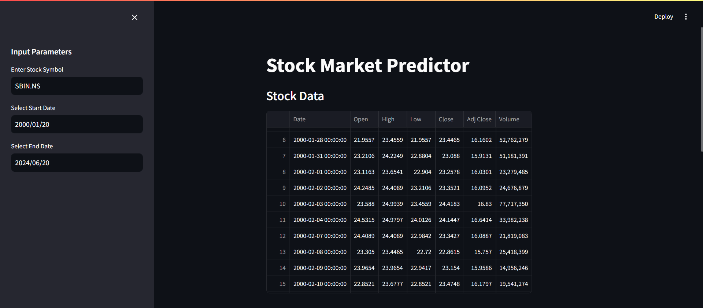
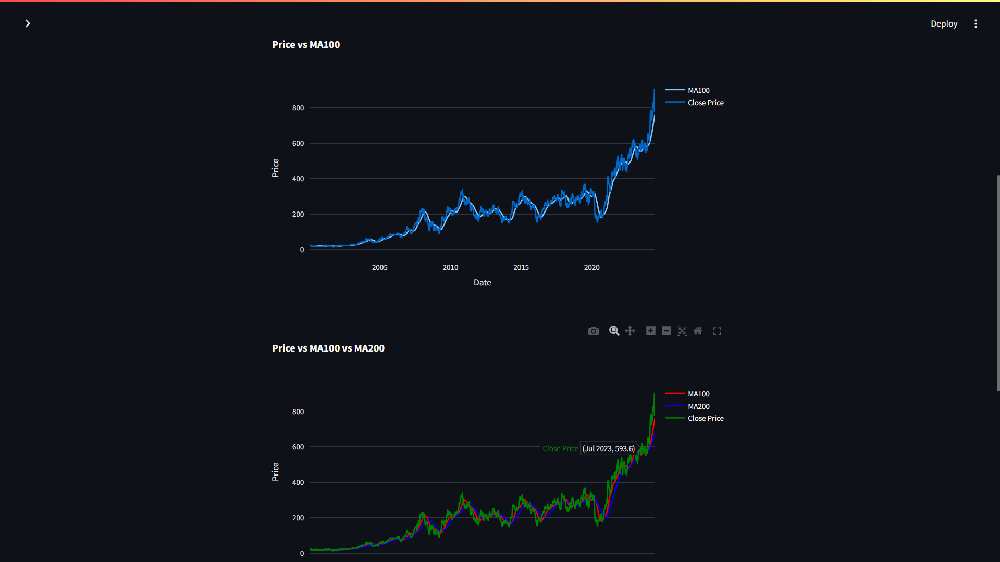
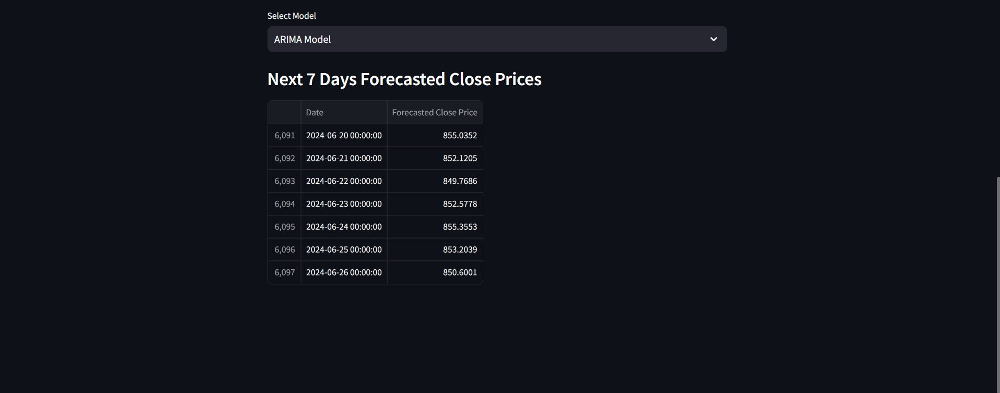

# Stock Prediction Application

Welcome to the Stock Prediction application! This project allows users to predict stock prices using various machine learning models. Below, you'll find instructions on how to set up and run the application, as well as screenshots showcasing its features.

## Features

- **Interactive Date Selection**: Choose the start and end date for the stock data.
- **Ticker Input**: Enter the stock ticker for the company you want to analyze.
- **Model Selection**: Choose from four different models for prediction:
  - Linear Regression
  - Decision Tree Regressor
  - Random Forest Regressor
  - Support Vector Regressor (SVR)
- **Data Visualization**: View the historical data and forecasted results.

## Setup Instructions

### Step 1: Clone the Repository

First, clone the repository to your local machine using the following command:

\`\`\`bash
git clone https://github.com/AdiRocks007/Stock-Prediction.git
\`\`\`

### Step 2: Create and Activate a Virtual Environment

Navigate to the project directory and create a virtual environment:

\`\`\`bash
cd Stock-Prediction
python -m venv venv
\`\`\`

Activate the virtual environment:

- On Windows:
  \`\`\`bash
  venv\Scripts\activate
  \`\`\`
- On macOS/Linux:
  \`\`\`bash
  source venv/bin/activate
  \`\`\`

### Step 3: Install Requirements

Install the necessary packages from the \`requirements.txt\` file:

\`\`\`bash
pip install -r requirements.txt
\`\`\`

### Step 4: Run the Application

Run the Streamlit application:

\`\`\`bash
streamlit run app.py
\`\`\`

## Usage

1. **Select Dates**: Use the date picker to choose the start and end date for the stock data.
2. **Enter Stock Ticker**: Input the stock ticker symbol (e.g., AAPL for Apple, GOOGL for Alphabet/Google).
3. **Select Model**: Choose one of the four available models to run the prediction.
4. **View Results**: The application will display the historical data and the forecasted stock prices.

## Screenshots

### 1. Input Dialog

### 2. Data Visualization

### 3. Forecasted Results

## Screen Recording

Watch this screen recording to see the application in action!

)

---

Thank you for using the Stock Prediction application! We hope it helps you in making better investment decisions.

For any queries, please contact [AdiRocks007](https://github.com/AdiRocks007).
